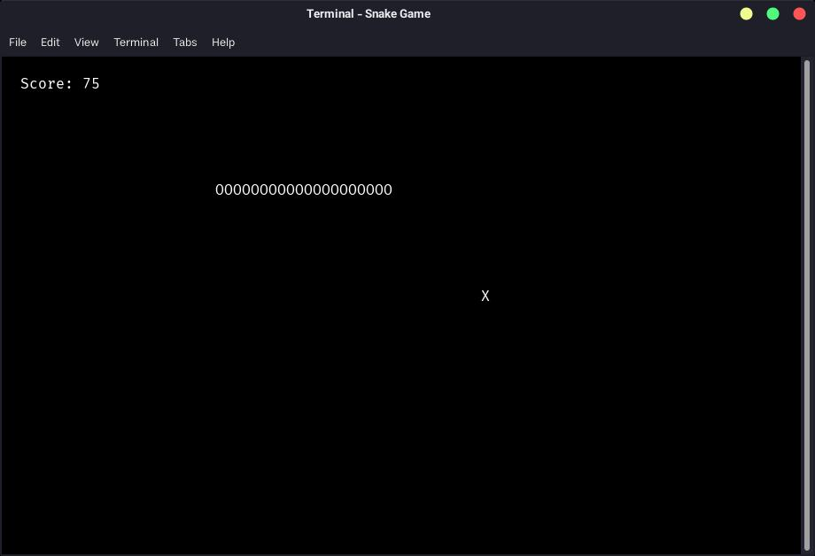
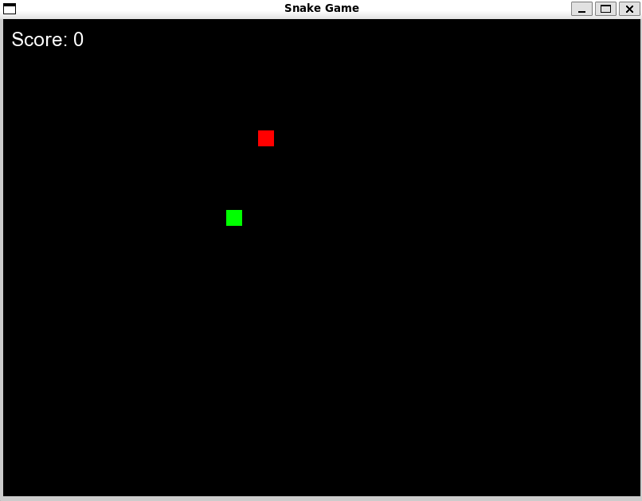
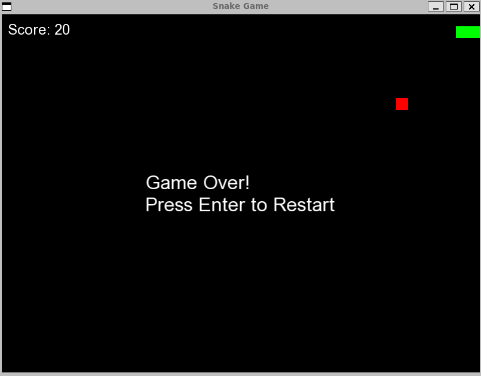

# Snake Game

Simple terminal Snake game in C++ using ncurses library. Mostly to learn/practice C++, and learn to use ncurses.

## CLI 

### Build Instructions
Compile the game using the following command:
```bash
g++ snake.cpp -lncurses -o snake
```

### Play game 
```bash
./snake
```

### Game Preview


## GUI

### Features
* **Snake Movement:** Control the snake using arrow keys or WASD keys.
* **Food:** Randomly generated food appears on the screen. Snake grows longer upon eating food, increasing the score.
* **Collision Detection:** Game ends if the snake collides with the walls or its own body.
* **Game Over:** Displayed with a "Game Over!" message and an option to restart by pressing Enter.
 
### Prerequisites

Before running the game, ensure you have SFML installed. You can install SFML on Linux using:
 
```
sudo apt-get install libsfml-dev
```
 
### Build Instructions
Compile the game using the following command:
 
```
g++ snake_game.cpp -o snake-game -lsfml-graphics -lsfml-window -lsfml-system
```
 
### How to Play
1. **Controls:**
 
* Use arrow keys (Up, Down, Left, Right) or WASD keys to control the snake's direction.
* Press Enter to restart the game when prompted after Game Over.
 
2. **Objective:**
 
* Eat food to grow the snake and earn points.
* Avoid colliding with walls or the snake's own body.
 
3. **Game Over:**
 
* The game ends when the snake collides with a wall or itself.
* A "Game Over!" message is displayed along with an option to restart the game.
 
### Game Preview

**Starting the game:**
 

 
**Game Over:**
 

